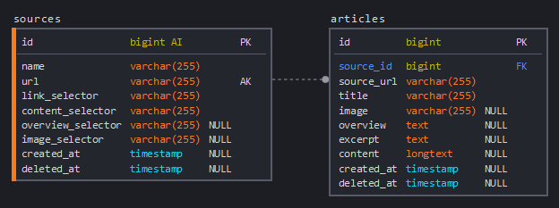

## About the Project

This is a test assignment for the **4people**. The project allows to scrape news web sites based on CSS selector rules and store the news content in the database.

**[Live version](http://4people.doozza.xyz)**

### Features

* adding custom sources
* scraping
  * requires user action
  * go to Manage tab, pick one source and press `Scrape!`
  * wait at least 15-20 seconds, you should see debug output
  * crawler has a timeout and page limit to prevent abuse
* viewing saved article previews, paginated
* viewing full article content with image (if parsed successfully)
* providing links to original articles

### Project structure and things implemented

* two models: `Source` and `Article` with respective controllers
* dependency injection:
    * `Crawler` implements `CrawlerInterface`, injected in `AppServiceProvider`
    * `ArticleService` is injected automatically into `SourceController` by Laravel
* custom crawler exceptions `CrawlerException` and `CrawlerLinksNotFoundException` with implemented render methods
* crawler page limit and timeout are configured through env variables `CRAWL_PAGE_LIMIT` and `CRAWL_SLEEP_MICROSECONDS`
* database migrations with two source seeders (for rbc.ru and lenta.ru)

### Things not implemented
* l10n/i18n
* testing

### Database schema

## License

The Laravel framework is open-sourced software licensed under the [MIT license](https://opensource.org/licenses/MIT).

## Built with Laravel and Tailwind CSS

